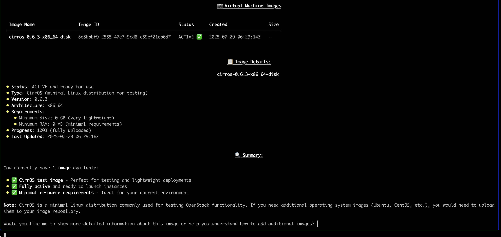
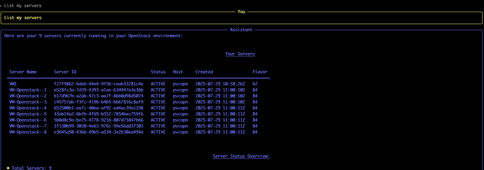

# OpenStack MCP Server

MCP server for OpenStack infrastructure management. Connects to OpenStack APIs and exposes 17 tools for managing compute, storage, and networking resources.

## Features

- List and manage servers, hypervisors, flavors
- View images and storage volumes
- Network and subnet management
- Resource utilization monitoring
- Service health checks
- Infrastructure inventory reports

## Configuration

Set OpenStack environment variables:
```bash
export OS_AUTH_URL=https://your-openstack-endpoint:5000/v3
export OS_USERNAME=admin
export OS_PASSWORD=your-password  
export OS_PROJECT_NAME=admin
export OS_USER_DOMAIN_NAME=Default
export OS_REGION_NAME=RegionOne
```

Or add them in `config/openstack_config.json`:
```json
{
    "AUTH_URL": "https://your-openstack-endpoint:5000/v3",
    "USERNAME": "admin", 
    "PASSWORD": "your-password",
    "PROJECT": "admin",
    "DOMAIN": "Default",
    "REGION": "RegionOne"
}
```

## Usage

**For MCP CLI, update `server_config.json` (or create if not present):**
```json
{
  "mcpServers": {
    "openstack": {
      "command": "/path/to/your/python3",
      "args": ["/path/to/openstack-mcp-server/openstack_mcp_server.py"],
      "env": {
        "OPENSTACK_CONFIG_PATH": "/path/to/your/config/openstack_config.json"
      }
    }
  }
}
```

**For Claude Desktop, add to MCP config:**
```json
{
  "mcpServers": {
    "openstack": {
      "command": "/path/to/your/python3",
      "args": ["/path/to/openstack-mcp-server/openstack_mcp_server.py"],
      "env": {
        "OPENSTACK_CONFIG_PATH": "/path/to/your/config/openstack_config.json"
      }
    }
  }
}
```

## Available Tools

| Tool Name | Description |
|-----------|-------------|
| `list_servers` | List all virtual machines with status and configuration |
| `get_server_details` | Get detailed information about a specific server |
| `list_hypervisors` | Show hypervisor hosts with resource usage |
| `list_flavors` | List compute flavors with resource specifications |
| `get_flavor_details` | Get detailed flavor information |
| `list_images` | Show available VM images |
| `get_image_details` | Get detailed image information |
| `list_volumes` | List storage volumes with status and size |
| `list_volume_types` | Show available volume types |
| `list_networks` | List networks with configuration details |
| `list_subnets` | Show subnets with CIDR and gateway info |
| `list_routers` | List routers with gateway configuration |
| `analyze_server_resources` | Analyze server resource allocation and health |
| `get_infrastructure_summary` | Complete infrastructure overview |
| `get_resource_utilization` | Current resource usage across hypervisors |
| `check_service_health` | Health status of OpenStack services |
| `generate_inventory_report` | Detailed inventory with optimization recommendations |

## Demo

[](https://www.youtube.com/watch?v=lWSXS_vVMEE)

## Usage Examples








## Requirements

- Python 3.8+
- OpenStack environment

## Author

Sreenath (zreenathmenon@gmail.com)